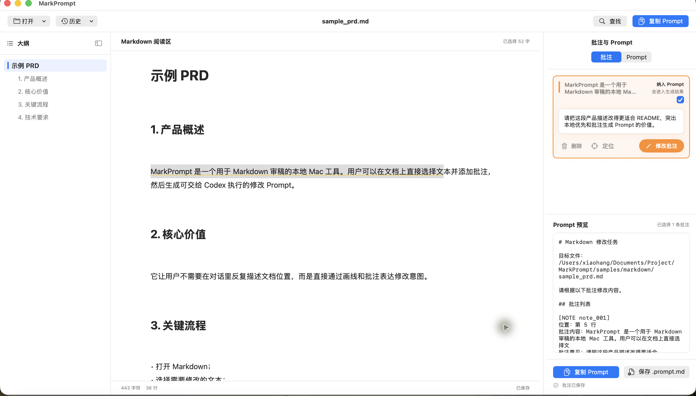
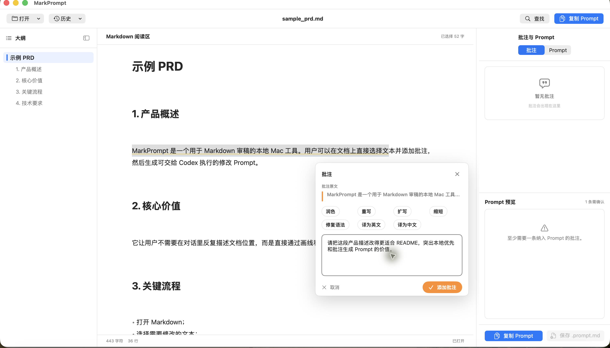
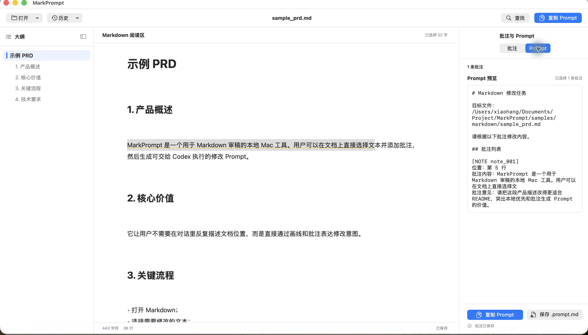

# MarkPrompt

MarkPrompt 是一个本地优先的 macOS Markdown 审稿工具。它面向“读文档、标问题、生成可执行修改 Prompt”的工作流：打开 Markdown 后，可以在渲染阅读区选择原文、创建批注、维护批注清单，并把纳入修改范围的批注汇总成可交给 Codex / Claude Code 使用的文件修改 Prompt。



## 下载

最新版本：V1.1

[下载 MarkPrompt-1.1.dmg](https://github.com/hanglu-lxh/MarkPrompt/releases/download/v1.1/MarkPrompt-1.1.dmg)

要求 macOS 14+。如果链接暂时无法打开，请先在 GitHub Releases 中发布 `v1.1`，并把本地生成的 `build/MarkPrompt-1.1.dmg` 上传为 Release asset。

## 安装

1. 下载 `MarkPrompt-1.1.dmg`。
2. 双击打开 DMG。
3. 将 `MarkPrompt.app` 拖入 `Applications`。
4. 从 `Applications` 打开 MarkPrompt。
5. 首次打开时，如果 macOS 提示无法验证开发者，可以在 Finder 中右键 `MarkPrompt.app`，选择“打开”，再确认打开。

MarkPrompt 默认在本地读取和保存文件，不会上传你的 Markdown 文档。

## 使用方法

1. 点击左上角“打开”，或按 `⌘O`，选择一个 `.md` / `.markdown` 文件。
2. 在中间阅读区阅读 Markdown。左侧大纲可以快速跳转标题。
3. 用鼠标选中需要修改的原文。
4. 点击选区旁的“批注 +”，输入修改意见，也可以使用“润色”“重写”“扩写”“缩短”等快捷批注。
5. 右侧“批注”面板会显示批注卡片。勾选“纳入 Prompt”的批注会进入最终修改指令。
6. 切换到“Prompt”面板，预览自动生成的 Markdown 修改 Prompt。
7. 点击“复制 Prompt”粘贴给 Codex / Claude Code，或点击“保存 .prompt.md”写入本地 Prompt 文件。





## 保存规则

- 批注会优先保存到原 Markdown 文件旁边的 `.review.json` 文件。
- Prompt 会保存为同目录下的 `.prompt.md` 文件。
- 如果原目录不可写，应用会保存到本机应用数据目录作为 fallback。
- 打开同一个 Markdown 文件时，MarkPrompt 会自动恢复对应批注。

## 功能概览

- 原生 macOS 应用：`swift run MarkPrompt` 可启动本地应用，`scripts/package_app.sh` 可生成 `build/MarkPrompt.app`。
- Markdown 导入：支持通过打开面板、最近文档、拖拽文件和剪贴板候选路径打开 `.md` / `.markdown`。
- 阅读体验：中间阅读区基于 AppKit / TextKit 渲染 Markdown，支持标题大纲导航、查找、文本选择、批注高亮、当前阅读标题跟踪和宽表横向布局。
- Markdown 渲染覆盖：已覆盖标题、列表、任务列表、代码块、表格、引用、脚注、图片、链接、Front Matter、HTML 表格、数学/mermaid fallback、Obsidian 风格链接与嵌入等常见阅读场景。
- 批注工作流：支持从选区创建批注、快捷提示、右侧卡片编辑、删除、定位、排除或纳入 Prompt，并处理重复选区、空批注、锚点丢失等状态。
- 本地持久化：批注保存为 Markdown 旁侧 `.review.json`，并带有应用数据目录 fallback、损坏 sidecar 备份、自动保存和关闭前保存保护。
- Prompt 生成：右侧 Prompt 面板可实时预览、复制并保存修改 Prompt；复制或保存前会同步当前批注。
- 任务项编辑：阅读区内的 Markdown 任务 checkbox 支持切换状态、撤销和外部修改保护。
- 测试与验收：仓库包含模型、解析渲染、锚点恢复、持久化、Prompt 生成、应用状态流、布局交互和 fixture 快照相关测试。

## 从源码运行

要求 macOS 14+ 和 Swift 6 工具链。

```bash
cd app/MarkPrompt
swift run MarkPrompt
```

应用启动后可通过工具栏、`⌘O`、拖拽或最近文档打开 Markdown。可优先试用仓库根目录下的样例：

```text
samples/markdown/sample_prd.md
```

## 测试与本地打包

```bash
cd app/MarkPrompt
swift test
```

生成 `.app`：

```bash
cd app/MarkPrompt
./scripts/package_app.sh
```

生成 `.dmg`：

```bash
cd app/MarkPrompt
./scripts/package_dmg.sh
```

打包产物会生成到仓库根目录：

```text
build/MarkPrompt.app
build/MarkPrompt-1.1.dmg
```

阅读区 fixture 快照可用于人工检查浅色和深色阅读效果：

```bash
cd app/MarkPrompt
swift run ReaderFixtureSnapshotTool
swift run ReaderFixtureSnapshotTool --appearance dark --output docs/assets/reader-fixture-snapshots-dark
```

## 发布 DMG 到 GitHub

推荐把 DMG 上传到 GitHub Releases，而不是直接提交到仓库。

```bash
git tag v1.1
git push origin v1.1

gh release create v1.1 build/MarkPrompt-1.1.dmg \
  --title "MarkPrompt V1.1" \
  --notes "MarkPrompt V1.1 macOS DMG release."
```

如果仓库是公开的，朋友可以直接通过 README 顶部的下载链接获取 DMG。GitHub 私有仓库的 Release 资产同样需要访问权限；如果要无需登录就能下载，需要将仓库公开，或改用公开仓库 / 其他公开文件分发方式。

## Workspace

```text
.
├── app/MarkPrompt/              # Swift Package 版 macOS 应用、MarkPromptKit、测试和打包脚本
├── docs/                        # 产品文档、阅读器验收记录、原型图和渲染快照资产
├── samples/                     # 本地 Markdown 样例和 reader fixture
├── scripts/                     # 仓库级辅助脚本
├── build/                       # 本地打包产物目录
└── .github/                     # GitHub 配置
```

## 参考资料

这些文档保留为产品和技术背景参考，当前状态请优先以 `app/MarkPrompt` 的实现和测试为准。

- [产品需求文档](docs/MarkPrompt_PRD.md)
- [产品交互说明](docs/MarkPrompt_interaction_spec.md)
- [技术开发文档](docs/MarkPrompt_technical_development.md)
- [Workspace 文件规划](docs/MarkPrompt_workspace_plan.md)
- [阅读器基准记录](docs/MarkPrompt_reader_benchmark.md)
- [阅读器 fixture 审计](docs/MarkPrompt_reader_fixture_audit.md)
- [V4 原型图](docs/assets/markprompt_interaction_prototype_v4.png)
