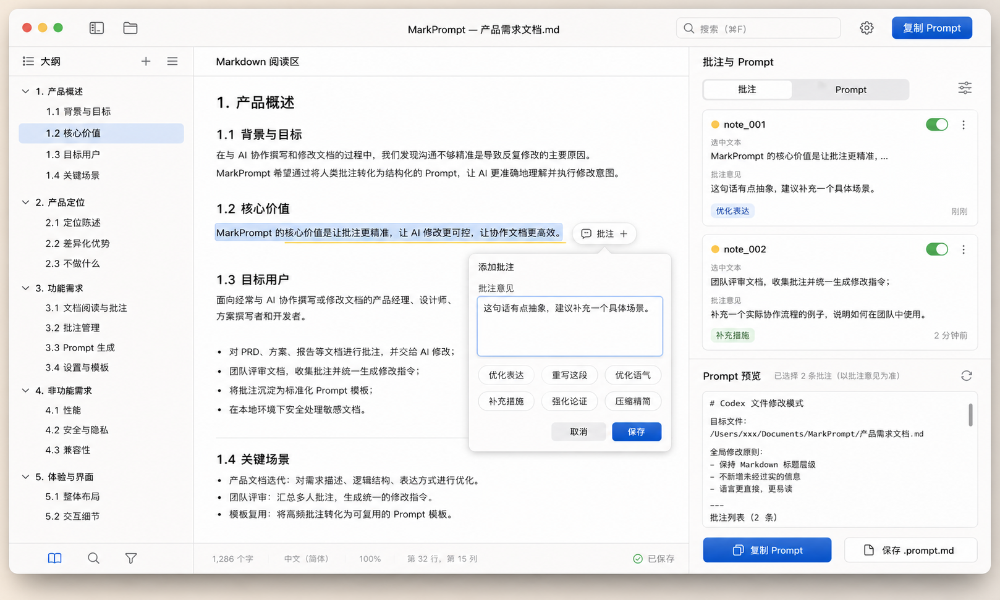

# MarkPrompt 产品交互说明

> 交互版本：V4  
> 对应原型：`docs/assets/markprompt_interaction_prototype_v4.png`  
> 文档用途：描述 MarkPrompt 的主界面结构、核心交互、状态变化和实现细节，供设计细化和工程开发使用。



---

## 1. 交互目标

MarkPrompt 的交互目标是让用户在阅读 Markdown 时自然完成审稿，并把批注稳定转化为 Prompt。

这套交互的核心不是“管理批注”，而是：

> 在不打断阅读的前提下，把局部修改意见沉淀为可执行 Prompt。

因此，主流程必须满足：

- 不离开当前文档；
- 不打开独立管理窗口；
- 不要求用户填写复杂结构字段；
- 批注和 Prompt 始终可见、可控、可复制。

---

## 2. 主界面结构

V4 使用一窗三栏结构。

```text
Toolbar
├── 左侧：文档大纲
├── 中间：Markdown 阅读区
└── 右侧：批注与 Prompt
```

### 2.1 顶部工具栏

组成：

- macOS traffic light；
- 侧栏切换；
- 打开文件；
- 居中文档标题；
- 搜索框；
- 设置按钮；
- `复制 Prompt` 主按钮。

交互规则：

- `复制 Prompt` 始终复制当前右侧面板中的有效 Prompt；
- 当没有有效批注时，按钮置灰或复制一个空状态说明；
- 搜索框用于文档内搜索，不搜索批注时可在右侧筛选入口完成。

### 2.2 左侧文档大纲

用途：

- 展示文档标题结构；
- 帮助用户在长文档中快速跳转；
- 标记当前阅读章节。

交互规则：

- 点击大纲项，中间阅读区滚动到对应标题；
- 当前章节高亮；
- 已批注章节可显示轻量点状提示；
- 大纲可以折叠，但默认展开到 H3。

### 2.3 中间 Markdown 阅读区

用途：

- 承载阅读、选择、画线、批注入口。

阅读区状态：

| 状态 | 表现 |
|---|---|
| 默认 | 展示渲染后的 Markdown |
| 选中文本 | 文本出现系统选区高亮 |
| 可批注 | 选区旁显示 `批注 +` 浮动按钮 |
| 已批注 | 文本下方显示轻量黄色下划线或柔和高亮 |
| 当前批注 | 对应标记更醒目，右侧卡片同步高亮 |

### 2.4 右侧批注与 Prompt 面板

用途：

- 展示批注卡片；
- 控制批注是否进入 Prompt；
- 实时预览 Prompt；
- 执行复制和保存。

结构：

```text
批注与 Prompt
├── 分段控件：批注 / Prompt
├── 批注卡片列表
├── Prompt 预览
└── 底部操作：复制 Prompt / 保存 .prompt.md
```

交互规则：

- 默认展示批注列表和 Prompt 预览；
- 切到 `Prompt` 分段时，右侧面板扩大 Prompt 预览占比；
- 不打开独立 Prompt 生成弹窗；
- 批注变化后，Prompt 预览实时更新。

---

## 3. 添加批注流程

### 3.1 选中文本

用户在阅读区拖拽选择一句话、一段话或跨行文本。

系统行为：

- 保持系统文本选区；
- 计算选区锚点；
- 在选区末端附近显示 `批注 +` 浮动按钮。

浮动按钮要求：

- 距离选区 8-12px；
- 不遮挡选区文字；
- 保持轻量阴影；
- 用户继续选择文本时跟随移动；
- 用户点击空白处或滚动较远时消失。

### 3.2 打开添加批注弹框

用户点击 `批注 +` 后，出现小型锚定弹框。

弹框结构：

```text
添加批注
批注意见
[ 多行输入框 ]

[优化表达] [重写这段] [优化语气]
[补充措施] [强化论证] [压缩精简]

[取消] [保存]
```

重要限制：

- 不展示“类型”；
- 不展示“范围”；
- 不展示“强度”；
- 不展示复杂标签和分类表单。

### 3.3 输入批注意见

用户可以直接输入自然语言，例如：

```text
这句话有点抽象，建议补充一个具体场景，让价值更可感知。
```

系统要求：

- 输入框自动聚焦；
- 支持多行；
- 支持粘贴文本；
- 高度可随内容轻微增长，但不应遮挡过多正文；
- 空内容点击保存时提示用户补充意见。

### 3.4 使用快捷提示

用户点击快捷提示按钮后，系统向输入框插入文本。

插入规则：

- 输入框为空：直接填入提示文本；
- 输入框有内容：在新行追加提示文本；
- 插入后光标停在文本末尾；
- 用户可以继续编辑。

默认按钮和文本：

| 按钮 | 插入文本 |
|---|---|
| 优化表达 | 请优化这段表达，让它更清晰、更直接，但保持原意。 |
| 重写这段 | 请重写这段内容，保留核心观点，但让逻辑和表达更顺。 |
| 优化语气 | 请调整这段语气，让它更专业、更克制。 |
| 补充措施 | 请补充更具体的行动措施或落地方式。 |
| 强化论证 | 请加强这段论证，让观点和结论更有说服力。 |
| 压缩精简 | 请压缩这段内容，去掉重复和不必要的表达。 |

### 3.5 保存批注

用户点击 `保存` 后：

1. 弹框关闭；
2. 正文选区变成批注标记；
3. 右侧新增批注卡片；
4. Prompt 预览立即刷新；
5. 审稿会话自动保存。

保存失败时：

- 保留弹框内容；
- 展示轻量错误提示；
- 不丢失用户输入。

---

## 4. 批注卡片交互

### 4.1 卡片内容

每张批注卡片展示：

- 批注编号；
- 选中文本摘要；
- 批注意见；
- 快捷提示标签；
- 是否纳入 Prompt 的开关；
- 更多操作按钮。

推荐结构：

```text
note_001                         [开关] [...]
选中文本
MarkPrompt 的核心价值是让批注更精准，...

批注意见
这句话有点抽象，建议补充一个具体场景。

[优化表达]                              刚刚
```

### 4.2 点击卡片

点击卡片后：

- 中间阅读区滚动到对应选区；
- 对应正文标记高亮；
- 卡片进入选中态；
- 右侧 Prompt 预览可以同步滚动到对应 note。

### 4.3 编辑批注

用户可通过卡片更多菜单或双击批注意见进入编辑。

编辑方式：

- 优先使用卡片内联编辑；
- 若空间不足，可复用添加批注小弹框；
- 不打开单独批注管理窗口。

编辑保存后：

- 卡片内容更新；
- Prompt 预览刷新；
- `.review.json` 自动保存。

### 4.4 排除批注

卡片右上角开关用于控制是否纳入 Prompt。

开关关闭后：

- 卡片变为弱化状态；
- 正文标记变淡；
- Prompt 预览移除该批注；
- 批注仍保留在列表中。

### 4.5 删除批注

删除入口位于更多菜单。

删除后：

- 卡片移除；
- 正文标记移除；
- Prompt 预览刷新；
- 支持撤销或轻量确认。

---

## 5. Prompt 预览交互

### 5.1 默认状态

Prompt 预览默认位于右侧面板下半部分。它是实时预览，不是结果弹窗。

展示内容：

- 当前模板名称；
- 目标文件路径；
- 全局修改原则；
- 已纳入批注数量；
- 批注列表摘要。

### 5.2 复制 Prompt

用户可通过两个入口复制：

- 顶部工具栏 `复制 Prompt`；
- 右侧底部 `复制 Prompt`。

复制后：

- 按钮短暂显示成功状态；
- 不改变用户当前阅读位置；
- 不自动打开其他应用。

### 5.3 保存 Prompt

点击 `保存 .prompt.md` 后：

- 默认保存到源文件同目录；
- 文件名使用源文件名加 `.prompt.md`；
- 如目录不可写，保存到应用数据目录并提示用户。

### 5.4 切换 Prompt 分段

右侧顶部的 `批注 / Prompt` 分段控件用于切换信息重点。

`批注` 分段：

- 批注列表占主要高度；
- Prompt 预览保持紧凑。

`Prompt` 分段：

- Prompt 预览占主要高度；
- 批注列表压缩为摘要或隐藏到上方；
- 仍然保持在右侧同一面板内。

---

## 6. 状态与异常

### 6.1 空文档状态

没有打开文档时，主窗口显示轻量入口：

- 打开 Markdown；
- 拖拽文件；
- 从剪贴板创建临时文档；
- 最近文件。

### 6.2 无批注状态

打开文档但没有批注时：

- 右侧批注列表显示空状态；
- Prompt 预览显示需要至少一条有效批注；
- `复制 Prompt` 置灰或复制空状态说明。

### 6.3 定位失效

当源文档变化导致批注无法定位时：

- 卡片显示 `定位需确认`；
- 正文不强行高亮；
- Prompt 中标记定位不确定；
- 用户可重新选择文本修复锚点。

### 6.4 源文件不可写

当无法在源文件目录保存 sidecar 文件时：

- 批注仍然可以创建；
- 应保存到应用数据目录；
- 状态栏提示保存位置变化；
- 用户可在设置中打开保存位置。

---

## 7. 快捷键

建议快捷键：

| 快捷键 | 动作 |
|---|---|
| `⌘O` | 打开 Markdown |
| `⌘F` | 搜索文档 |
| `⌘⇧A` | 对当前选区添加批注 |
| `⌘C` | 正常复制选中文本 |
| `⌘⇧C` | 复制当前 Prompt |
| `⌘S` | 保存审稿会话 |
| `Esc` | 关闭当前批注弹框 |

---

## 8. 动效与细节

### 8.1 浮动按钮

- 选区稳定后 100-150ms 内淡入；
- 取消选择后淡出；
- 点击时保持选区不丢失。

### 8.2 添加批注弹框

- 从浮动按钮位置轻微展开；
- 阴影轻，不抢阅读焦点；
- 保存后快速收起。

### 8.3 批注卡片

- 新增卡片轻微淡入；
- 当前卡片使用浅蓝或浅灰背景；
- 排除状态降低透明度。

### 8.4 Prompt 预览

- 内容变化时不闪烁；
- 保持滚动位置，除非用户主动复制或切换模板；
- 超长 Prompt 显示滚动条。

---

## 9. 实现注意事项

### 9.1 选区和锚点

选区锚点必须同时保存：

- 原文 selected_text；
- 起止 offset；
- 所属标题路径；
- 前后上下文；
- 文档 hash。

这样可以兼顾精确定位和文档变化后的恢复。

### 9.2 快捷提示不是结构字段

快捷提示只影响输入框文本和可选 metadata。

实现上可以记录：

- 用户点击过哪些快捷提示；
- 每个快捷提示插入了什么文本；
- 系统推断出的 intent。

但界面和 Prompt 必须以用户最终批注意见为准。

### 9.3 Prompt 实时生成

Prompt 预览可以在本地实时生成，不需要调用模型。

触发刷新：

- 新增批注；
- 编辑批注；
- 删除批注；
- 切换纳入 Prompt；
- 切换模板；
- 源文件路径变化。

### 9.4 本地优先

默认不上传文档和批注内容。

本地保存：

```text
source.md
source.review.json
source.prompt.md
```

---

## 10. V4 交互验收标准

- 主流程在一个窗口内完成；
- 选中文本后出现 `批注 +` 浮动按钮；
- 点击后出现锚定小弹框；
- 小弹框不包含类型、范围、强度；
- 快捷提示按钮会填充批注意见文本；
- 用户文本是最终批注依据；
- 右侧批注卡片实时新增；
- Prompt 预览在右侧同一面板内实时更新；
- 顶部和右侧均可复制 Prompt；
- 旧式独立批注管理弹窗和独立 Prompt 生成弹窗不再出现。
