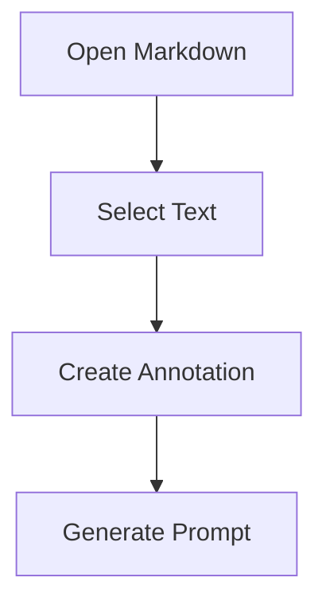

# Reader Fixture: Math and Mermaid Fallback

Inline math should render as a compact formula token: $E = mc^2$.

Price text should not be mistaken for math: $19.99/month and $0.04 per render.

Block math should not disappear:

$$
\int_0^1 x^2 dx = \frac{1}{3}
$$

Mermaid should keep readable source while showing a lightweight native preview for simple flowcharts.

